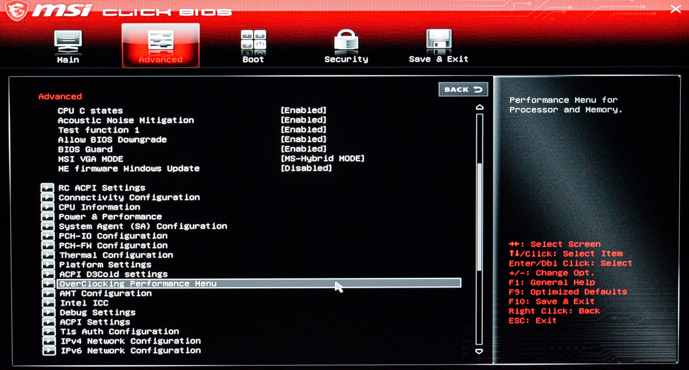
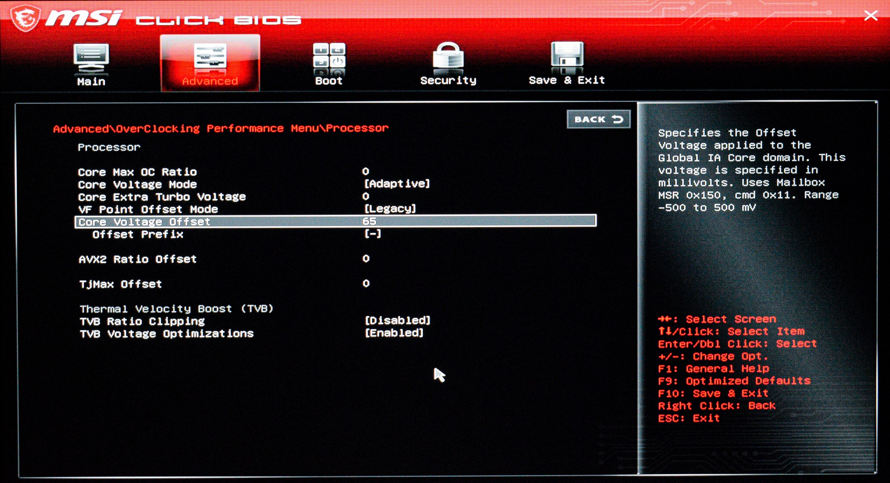
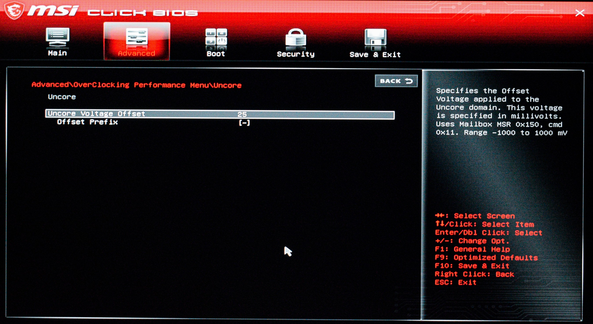
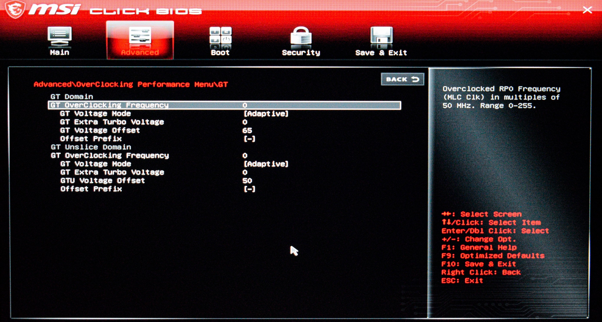

# Configuring undervolt on MSI laptops
Undervoltage can be useful to reduce power consumption and CPU load. For my experience, laptops have a small margin of undervolt, since CPU are already configured with good values. Depending on the brand and model, one can achieve different values of undervolting. In my case, I found that a safe value for my CPU is $-65mV$. I tried several values up to $-125mV$ and experienced random freezes.

Undervolting can also be done directly from Windows using third party software like `Throttlestop` or native drivers like `MSI Afterburn`. I have a *MSI GP66* and its driver is `DragonCenter` and it doesn't allow undervolt. I tried using `Throttlestop`, but I ended up using the BIOS because I had some problems enabling the undervoltage option in `Throttlestop`, and I had no guarantee that the undervoltage would even work.

## Undervolting from the BIOS
From now on, please note that this procedure is specific to Intel processor and some parts may vary on different models.
 
Boot you pc. While the MSI logo is showing, press the `Canc`/`Del` key one or more times. Now access the advanced BIOS using `right-ctrl`+`right-shift`+`left_alt`+`F2` (it may differ slightly on different models). You can tell you've entered the advanced BIOS because many entries are displayed.

Now, in the *Advanced* tab, locate ther *Overclocking Performance Menu*.

    

$\text{\Large{Important: Make sure that the \textit{Offset Prefix} is set to "-".}}$

### Processor
The cores of the CPU. I set the undervolt to $-65mV$.

    

### Uncore
The term "Uncore" refers to the components of the CPU that are not part of the core. So, it includes the memory controller, cache hierarchy, and interconnects like the Ring Bus. It has its own voltage, separate from the core. I set the undervolt to $-25mV$. As suggested in a MSI guide i followed, the Uncore should not be undervolted too much.

    

### Ring
The Ring Bus connects the other components in the CPU. The ring is often linked to the uncore voltage domain, so I didn't touch anything here.

### Graphics Technology (GT)
The integrated graphics on the CPU. I set the undervolt to $-65mV$.

    

